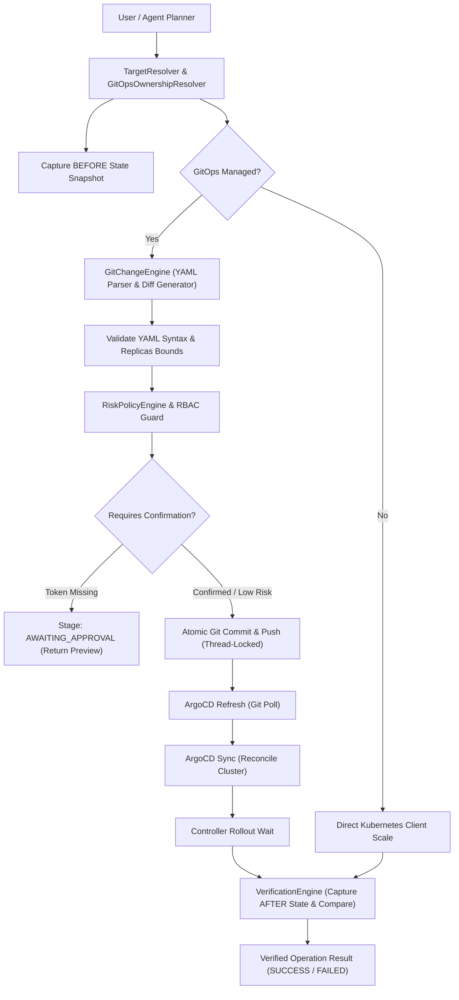

# Enterprise GitOps Source-of-Truth Control Plane Architecture

## 1. Overview & Core Principle

In DevOps Nexus, **Git is the sole desired-state source of truth** for all GitOps-managed workloads. Direct imperative mutations against the Kubernetes API (such as `kubectl scale` or direct PATCH requests) before or instead of Git modification are strictly prohibited.

The architecture enforces a declarative, verified lifecycle:

```
USER / AGENT REQUEST
        ↓
TARGET RESOLUTION & GITOPS OWNERSHIP CHECK
        ↓
READ CURRENT GIT DESIRED STATE
        ↓
GENERATE STRUCTURED CHANGE PREVIEW & DIFF
        ↓
YAML SYNTAX VALIDATION
        ↓
RBAC + RISK POLICY EVALUATION
        ↓
EXPLICIT APPROVAL / CONFIRMATION (IF REQUIRED)
        ↓
THREAD-SAFE GIT COMMIT & PUSH
        ↓
ARGOCD APPLICATION REFRESH (CACHE INVALIDATION)
        ↓
ARGOCD SYNCHRONIZE APPLICATION
        ↓
RECONCILIATION & ROLLOUT MONITORING
        ↓
DETERMINISTIC MULTI-DIMENSIONAL VERIFICATION (Git + K8s + ArgoCD)
        ↓
VERIFIED ACTION RESULT
```

---

## 2. Component Architecture



---

## 3. GitOps Control Plane Modules

| Module | Location | Responsibilities |
|---|---|---|
| `GitOpsOwnershipResolver` | `app/agent/gitops/ownership.py` | Determines if workload is GitOps-managed by matching ArgoCD applications and Helm chart directories (`helm/{service}`). Resolves target `values.yaml` paths. |
| `GitChangeEngine` | `app/agent/gitops/change_engine.py` | Safely reads YAML desired state, executes targeted field mutations (`replicaCount`, `hpa.minReplicas`, `hpa.maxReplicas`), validates syntax with PyYAML, generates unified diffs, and creates atomic commits with concurrency locking. |
| `GitOpsWorkflowEngine` | `app/agent/gitops/workflow.py` | Orchestrates the end-to-end Git-first lifecycle, manages stage transitions, handles confirmation guards, and drives post-action state verification. |
| `VerificationEngine` | `app/agent/verification_engine.py` | Captures pre- and post-action snapshots, comparing Git desired state, Kubernetes runtime pod/deployment state, and ArgoCD sync/health status. |

---

## 4. Operation Lifecycle Stages

The platform tracks operations through granular, actionable states:

### Progression Stages
* `PLANNED`: Target resolved, ownership verified, change preview constructed.
* `AWAITING_APPROVAL`: Operation gated by Risk Policy; requires explicit `CONFIRM` token.
* `APPROVED`: Confirmation token validated.
* `GIT_MODIFYING`: Desired state written to staged manifest.
* `GIT_VALIDATING`: YAML syntax and diff verified.
* `GIT_COMMITTING`: Git commit created with standardized audit message.
* `GIT_PUSHING`: Commit pushed to upstream remote repository.
* `ARGOCD_REFRESHING`: ArgoCD cache invalidated to discover latest Git commit.
* `ARGOCD_SYNCING`: ArgoCD declarative sync triggered.
* `RECONCILING`: Controller reconciling pods to desired replica count.
* `VERIFYING`: `VerificationEngine` comparing BEFORE and AFTER state snapshots.
* `COMPLETED`: All three tiers (Git, K8s, ArgoCD) verified consistent.

### Explicit Failure Stages
* `APPROVAL_REJECTED`: Missing or invalid confirmation token.
* `GIT_VALIDATION_FAILED`: Staged manifest has syntax or schema errors.
* `GIT_COMMIT_FAILED`: Local Git commit failed.
* `GIT_PUSH_FAILED`: Remote push rejected or unreachable.
* `ARGOCD_SYNC_FAILED`: ArgoCD synchronization error.
* `ROLLOUT_FAILED`: Kubernetes pod scheduling or crash loop during rollout.
* `VERIFICATION_FAILED`: State mismatch between desired replicas and runtime pods.
* `TIMEOUT`: Reconciliation exceeded operational timeout.

---

## 5. Non-GitOps Imperative Workload Fallback

For workloads explicitly not managed by GitOps:
* `GitOpsOwnershipResolver` returns `is_gitops=False`.
* `GitOpsWorkflowEngine` routes mutation directly through `k8s_client.scale_deployment` under RBAC and Risk Policy guardrails.
* `VerificationEngine` performs runtime pod verification.
* The system clearly marks the execution as `is_gitops=False`.

---

## 6. Security & RBAC Enforcement

1. **Role Verification**: Tool execution and REST endpoints enforce IAM permissions (`deployments:scale_deployment`, `gitops:update`, `gitops:sync_application`).
2. **Audit Trail**: Every mutating execution logs structured audit telemetry in PostgreSQL recording `username`, `role`, `action`, `target_resource`, and execution outcome.
3. **Zero Secrets in State**: Tokens and credentials are never stored in GitOps diffs or returned to client endpoints.
