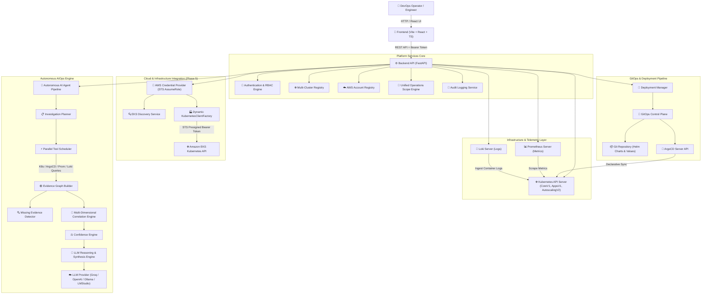

# DevOps Nexus — Enterprise System Architecture Specification

## Overview

**DevOps Nexus** is an Enterprise Internal Developer Platform (IDP), Autonomous AIOps Control Plane, and GitOps Management Engine. It bridges Kubernetes cluster operations, continuous delivery (ArgoCD), multi-dimensional telemetry (Prometheus & Loki), AWS multi-account Amazon EKS integration, and autonomous AI-driven root cause diagnostics into a unified operational workspace.

---

## 🏗️ High-Level System Architecture

---

## 🧩 Subsystem Specifications

### 1. Unified Operations Scope Engine (`ScopeContext`)
* **Purpose**: Enforces context-aware operational boundaries across on-premise Kubernetes and multi-account cloud environments.
* **Environments**:
  * `KUBERNETES`: On-premise or local development clusters (e.g. Minikube, Kubeadm).
  * `AWS_EKS`: Amazon Elastic Kubernetes Service clusters across registered AWS accounts and regions.
* **Modes**:
  * `CLUSTER`: Scopes telemetry and management to cluster-wide resources.
  * `NAMESPACE`: Scopes operations to a specific Kubernetes namespace (e.g. `devops-nexus-prod`).
  * `APPLICATION`: Scopes queries to specific microservice applications (e.g. `auth-service`, `gateway-service`).
  * `DOMAIN`: Scopes operations to microservice domain groups.

### 2. AWS Account Registration & Cross-Account Access (`app/aws/`)
* **Purpose**: Manages secure cross-account AWS access without storing long-lived access keys or secret keys.
* **Security Architecture**:
  * Role-based trust via AWS STS `AssumeRole`.
  * In-memory short-lived session caching with expiration refresh.
  * Account identity verification against target ARN to prevent account ID spoofing.
  * Ephemeral Kubernetes API authentication via `k8s-aws-v1.` STS presigned bearer tokens.

### 3. Amazon EKS Discovery & Dynamic Client Factory (`app/clients/k8s_factory.py`)
* **Purpose**: Discovers active EKS clusters and instantiates strongly typed Kubernetes API clients (`CoreV1Api`, `AppsV1Api`, `NetworkingV1Api`) on demand.
* **Capabilities**:
  * Queries EKS endpoints and certificate authority data.
  * Dynamically provisions client certificates and presigned auth tokens.
  * Routes all existing `ToolRegistry` tools (`k8s.get_pods`, `k8s.scale_deployment`, `k8s.restart_deployment`) transparently to the target EKS cluster without modifying tool logic.

### 4. Multi-Cluster Registry
* **Purpose**: Manages multi-cluster connection profiles, API contexts, and cluster health status.
* **Capabilities**: Registers local Minikube, kubeadm, and discovered EKS clusters dynamically with zero downtime.

### 5. Enterprise GitOps Control Plane
* **Purpose**: Enforces non-bypassable GitOps declarative state workflows for scaling, updates, and configuration changes.
* **Write-back Pipeline**: Automatically updates Helm `values-prod.yaml` files, commits to Git, pushes to remote origin, triggers ArgoCD sync, and monitors rollout status in real-time.

### 6. Autonomous AIOps Investigation Engine
* **Purpose**: Closed-loop diagnostic and verified remediation engine operating across on-premise and EKS environments.
* **Key Components**:
  * **`InvestigationPlanner`**: Constructs targeted investigation plans based on query intent.
  * **`ToolScheduler`**: Executes parallel queries against K8s API, ArgoCD, Prometheus, and Loki with retry limits.
  * **`EvidenceGraphBuilder`**: Assembles structured evidence nodes from active telemetry.
  * **`MissingEvidenceDetector`**: Auto-discovers missing dependencies, ReplicaSets, and pods.
  * **`CorrelationEngine`**: Evaluates cross-telemetry rules (Exit codes, OOMKilled events, sync drifts, node pressure).
  * **`ConfidenceEngine`**: Computes mathematical confidence scores (0% to 100%) based on evidence completeness.
  * **`ReasoningEngine`**: Formulates structured diagnostic reports narrated by LLM providers.
