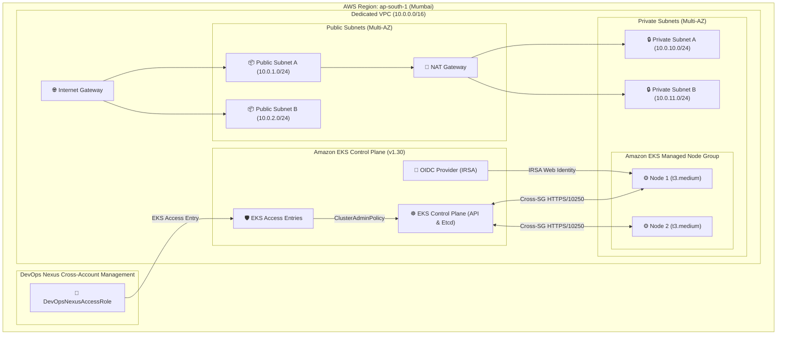

# DevOps Nexus — Terraform Amazon EKS Infrastructure Architecture

## Overview

Phase 6 provisions the production-oriented Amazon EKS infrastructure and multi-AZ network foundation using Terraform. The architecture decouples **Infrastructure Management** (Terraform) from **Application Deployment** (ArgoCD & Helm in Phase 7).

---

## 🏛️ Infrastructure Architecture Diagram



---

## 🧩 Module Specifications

### 1. Networking Module (`terraform/modules/networking/`)
- **VPC**: `10.0.0.0/16` with DNS hostnames and DNS resolution enabled.
- **Multi-AZ Subnets**:
  - Public Subnets (`10.0.1.0/24`, `10.0.2.0/24`) tagged with `kubernetes.io/role/elb = "1"`.
  - Private Subnets (`10.0.10.0/24`, `10.0.11.0/24`) tagged with `kubernetes.io/role/internal-elb = "1"` and `karpenter.sh/discovery = cluster_name`.
- **Egress & NAT**: Single or Multi-AZ NAT Gateways with Elastic IPs for private subnet internet egress.

### 2. IAM Module (`terraform/modules/iam/`)
- **EKS Cluster Role**: Assumed by `eks.amazonaws.com` with `AmazonEKSClusterPolicy` and `AmazonEKSVPCResourceController`.
- **Worker Node Role**: Assumed by `ec2.amazonaws.com` with `AmazonEKSWorkerNodePolicy`, `AmazonEKS_CNI_Policy`, and `AmazonEC2ContainerRegistryReadOnly`.
- **DevOps Nexus Access Role (`DevOpsNexusAccessRole`)**:
  - Dedicated cross-account IAM role for DevOps Nexus backend identity.
  - Least-privilege permissions: `sts:GetCallerIdentity`, `eks:ListClusters`, `eks:DescribeCluster`, `eks:ListAccessEntries`, `eks:DescribeAccessEntry`, `eks:AccessKubernetesApi`.
  - Zero `AdministratorAccess` policy attachments.

### 3. EKS Module (`terraform/modules/eks/`)
- **Control Plane**: Amazon EKS v1.30 with public & private API endpoint access.
- **Access Configuration**: `API_AND_CONFIG_MAP` with `aws_eks_access_entry` mapping `DevOpsNexusAccessRole` to `AmazonEKSClusterAdminPolicy`.
- **Managed Node Groups**: `general-compute` (t3.medium, 2 desired, min 1, max 4) in private subnets.
- **OIDC Provider**: Enables IAM Roles for Service Accounts (IRSA).
- **Core Add-ons**:
  - `vpc-cni` (AWS VPC CNI Plugin)
  - `kube-proxy` (Kubernetes network proxy)
  - `coredns` (Cluster DNS)
  - `aws-ebs-csi-driver` (EBS storage CSI driver with dedicated IRSA role)

---

## 🚀 Deployment & Operations

```bash
cd terraform

# Format and Validate
terraform fmt -check
terraform validate

# Plan with environment variables
terraform plan -var-file="terraform.tfvars.example"

# Apply infrastructure
terraform apply -var-file="terraform.tfvars.example"
```

## 💰 Cost Considerations
- **EKS Control Plane**: ~$0.10 / hour (~$73 / month)
- **NAT Gateway**: ~$0.045 / hour + data transfer
- **EC2 Worker Nodes**: 2x `t3.medium` (~$0.0416 / hour each)
- **Cleanup**: `terraform destroy -var-file="terraform.tfvars.example"`
